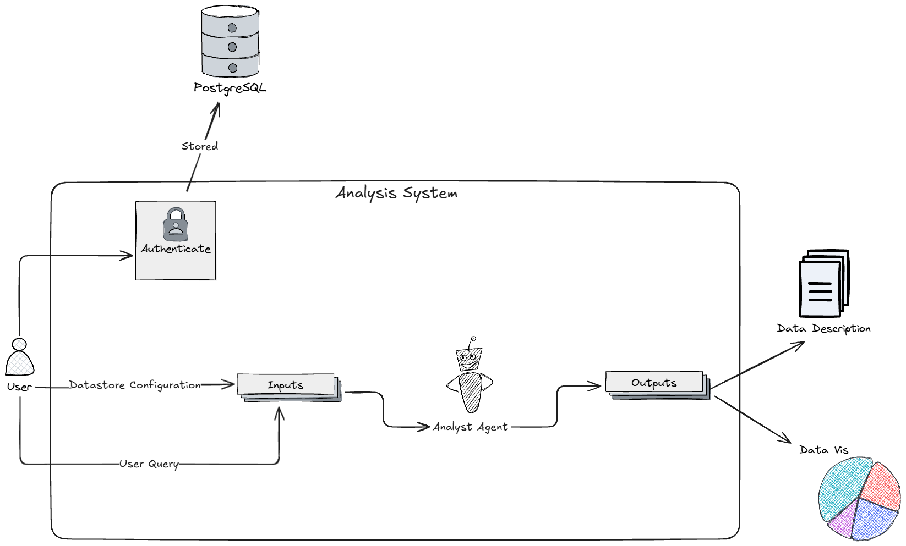

# Agent Dan AI

[](https://www.python.org/downloads/)
[](https://fastapi.tiangolo.com/)
[](https://langchain-ai.github.io/langgraph/)

An intelligent, production-ready data analysis agent powered by LangGraph and LLMs. This system leverages advanced AI capabilities combined with powerful data visualization tools to perform automated data analysis, generate insights, and create professional visualizations.

## 🎯 Project Overview

The **Data Analysis Agent** is an enterprise-grade application that combines:
- **LangGraph**: A framework for orchestrating complex AI workflows with state management and tool integration
- **Langfuse**: Production monitoring and evaluation of AI applications
- **Matplotlib & Seaborn**: Professional data visualization libraries
- **FastAPI**: Modern, high-performance HTTP API framework

This agent can autonomously analyze datasets, generate statistical insights, create visualizations, and provide data-driven recommendations through a conversational interface.

## 📊 Architecture

### System Architecture


### Agent Workflow


### Use Case Diagram


## ✨ Key Features

- **Autonomous Data Analysis**: Process datasets and extract meaningful insights automatically
- **Multi-Tool Integration**: Seamlessly integrates with data visualization and analysis tools
- **Conversation-Based Interface**: Interact with the agent through natural language
- **Production Monitoring**: Built-in observability with Langfuse for debugging and performance tracking
- **State Management**: Persistent conversation state using MongoDB checkpoints
- **Scalable Architecture**: FastAPI-based REST API for easy integration and deployment
- **Type Safety**: Full type hints and Pydantic validation for robust error handling

## 🛠️ Technologies Used

### Core Framework
- **[LangGraph](https://langchain-ai.github.io/langgraph/)** (v1.0.8): State machine framework for building autonomous agents with tool use capabilities
- **[FastAPI](https://fastapi.tiangolo.com/)** (v0.128.4): Modern web framework for building REST APIs
- **[Uvicorn](https://www.uvicorn.org/)** (v0.40.0): Lightning-fast ASGI server

### Observability & Production
- **[Langfuse](https://langfuse.com/)**: LLM observability, tracing, and evaluation platform for production monitoring
- **[Pydantic Settings](https://docs.pydantic.dev/latest/concepts/pydantic_settings/)**: Configuration management with environment variables

### Data Visualization
- **[Matplotlib](https://matplotlib.org/)**: Comprehensive plotting library for creating publication-quality figures
- **[Seaborn](https://seaborn.pydata.org/)**: Statistical data visualization library built on Matplotlib
- **[Plotly](https://plotly.com/python/)**: Interactive visualization capabilities

### Data Management
- **[MongoDB Checkpoint](https://langchain-ai.github.io/langgraph/)**: Persistent state storage for agent conversations and checkpoints

## 📋 Requirements

- **Python**: 3.11 or higher
- **OS**: Windows, macOS, or Linux
- **API Keys**: OpenRouter API key for LLM access (configured via environment variables)

## 🚀 Installation

### 1. Clone or navigate to the project directory

```bash
cd "Data Analysis Agent"
```

### 2. Create a virtual environment (recommended)

```bash
# Windows
python -m venv venv
venv\Scripts\activate

# macOS/Linux
python -m venv venv
source venv/bin/activate
```

### 3. Install dependencies

```bash
# Using pip
pip install -r requirements.txt

# Or using pip with pyproject.toml
pip install -e .
```

### 4. Configure environment variables

Create a `.env` file in the project root:

```env
OPENROUTER_API_KEY=your_api_key_here
LOG_DIR=src/logs
LOG_MAX_BYTES=10485760
LOG_BACKUP_COUNT=3
```

## 💻 Usage

### Starting the Server

Run the FastAPI server:

```bash
python main.py
```

The server will start at `http://127.0.0.1:5000`

### Expected Output

```
INFO:     Uvicorn running on http://127.0.0.1:5000
INFO:     Application startup complete
```

### API Endpoints

#### Health Check
```bash
curl http://127.0.0.1:5000/
```

**Response:**
```json
{
  "response": "Agent server is online!",
  "status_code": 200
}
```

### Example Usage Flow

1. **Start the agent server**
   ```bash
   python main.py
   ```

2. **Send analysis requests** via HTTP client
   ```bash
   curl -X POST http://127.0.0.1:5000/analyze \
     -H "Content-Type: application/json" \
     -d '{"data": "...", "query": "Analyze this dataset"}'
   ```

3. **Monitor with Langfuse**
   - Track all LLM calls and tool usage
   - Evaluate agent performance
   - Debug issues with detailed traces

## 📁 Project Structure

```
Data Analysis Agent/
├── main.py                          # FastAPI application entry point
├── requirements.txt                 # Python dependencies
├── pyproject.toml                   # Project metadata and configuration
├── README.md                        # This file
├── assets/                          # Architecture and diagram files
│   ├── analysis_system.excalidraw  # System architecture diagram
│   ├── analyst_agent.excalidraw    # Agent workflow diagram
│   └── use_case.excalidraw         # Use case diagram
├── experiments/                     # Research and experimentation notebooks
│   └── analyst_ai_agent.ipynb      # Jupyter notebook for agent prototyping
└── src/                            # Source code directory
    ├── __init__.py
    ├── agents/                     # Agent implementation
    │   ├── __init__.py
    │   ├── analyst_ai_agent.py    # Core agent logic
    │   ├── models/                # Data models
    │   │   └── __init__.py
    │   ├── prompts/               # LLM prompts
    │   │   └── __init__.py
    │   └── tools/                 # Agent tools
    │       └── __init__.py
    ├── configs/                    # Configuration management
    │   ├── __init__.py
    │   ├── app_config.py          # Application settings
    │   └── log_config.py          # Logging configuration
    └── routers/                    # API route handlers
        ├── __init__.py
        └── agent.py               # Agent endpoints
```

## 🔧 Configuration

### Application Settings (`src/configs/app_config.py`)

The application uses Pydantic Settings for configuration management:

```python
class Settings(BaseSettings):
    # App Configuration
    APP_NAME: str = "AnalystAI"
    APP_VERSION: str = "0.0.1"
    
    # OpenRouter Configuration
    OPENROUTER_API_KEY: str  # Required
    
    # Logging Configuration
    LOG_DIR: str = "src/logs"
    LOG_MAX_BYTES: int = 10485760
    LOG_BACKUP_COUNT: int = 3
```

All settings are loaded from environment variables, which can be specified in a `.env` file.

## 🧠 How It Works

### Agent Workflow

1. **User Input**: Receives analysis request through FastAPI endpoint
2. **State Management**: LangGraph maintains and updates conversation state
3. **Tool Execution**: Agent calls appropriate analysis and visualization tools
4. **Data Processing**: Matplotlib and Seaborn generate visualizations
5. **Response Generation**: LLM synthesizes findings and insights
6. **Monitoring**: All interactions logged to Langfuse for observability
7. **Output**: Returns analysis results and visualizations to the client

### LangGraph Integration

The agent uses LangGraph's powerful capabilities:
- **State Graphs**: Define conversation flow and decision logic
- **Tool Use**: Integrate custom tools for data analysis and visualization
- **Checkpointing**: Persist conversation state with MongoDB
- **Streaming**: Support for real-time response streaming

## 🚀 Next Steps

Future enhancements planned:
- [ ] Advanced statistical analysis tools
- [ ] Real-time data processing pipelines
- [ ] Multi-language support
- [ ] Custom model training capabilities
- [ ] Enhanced visualization options
- [ ] Database integration layer
- [ ] Comprehensive logging and monitoring dashboard

## 📝 Contributing

Contributions are welcome! Please follow these guidelines:

1. Create a feature branch (`git checkout -b feature/amazing-feature`)
2. Commit your changes (`git commit -m 'Add amazing feature'`)
3. Push to the branch (`git push origin feature/amazing-feature`)
4. Open a Pull Request

## 📄 License

This project is provided as-is for educational and commercial use.

## 🤝 Support

For issues, questions, or suggestions:
- Check existing issues in the repository
- Create a new issue with detailed information
- Contact the development team

## 📚 Resources

- [LangGraph Documentation](https://langchain-ai.github.io/langgraph/)
- [Langfuse Documentation](https://docs.langfuse.com/)
- [FastAPI Documentation](https://fastapi.tiangolo.com/)
- [Matplotlib Tutorial](https://matplotlib.org/stable/tutorials/index.html)
- [Seaborn Tutorial](https://seaborn.pydata.org/tutorial.html)

---

**Version**: 0.1.0  
**Last Updated**: February 2026  
**Status**: Active Development 
